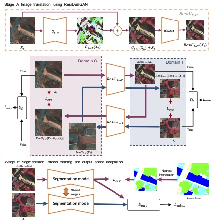

# ResiDualGAN&DRDG

Source code of RDG and DRDG. 

RDG: ResiDualGAN: Resize-Residual DualGAN for Cross-Domain Remote Sensing Images Semantic Segmentation. [[paper]](https://arxiv.org/abs/2201.11523)

By Yang Zhao, Han Gao, Peng Guo, Zihao Sun and Xiuwan Chen


DRDG: Depth-Assisted ResiDualGAN for Cross-Domain Aerial Images Semantic Segmentation.  [[paper]](https://arxiv.org/abs/2208.09823)

By Yang Zhao, Peng Guo, Han Gao, and Xiuwan Chen


# Overview



## Highlights
- **SOTA performance**. Higher than 51% of mIoU on cross-domain segmentation from PotsdamIRRG to Vaihingen was reported with a **single RDG model (w/o output adaptation)**. 
- **Potential space for futher research**. Higher than 53% of mIoU was reported in our paper (w output adaptation), which can be further improved by other self-training strategies or discriminative methods. (Related paper: [Cycle and Self-Supervised Consistency Training for Adapting Semantic Segmentation of Aerial Images](https://www.mdpi.com/2072-4292/14/7/1527))


# Get Started

## Build environment

Create environment and install dependencies. The code has been tested with PyTorch 1.8.1 and Cuda 10.2.
```
conda create -n rdg
source activate rdg
pip install torch==1.8.1 torchvision==0.9.1 torchaudio==0.8.1 yacs openpyxl matplotlib pandas segmentation_models_pytorch albumentations
```

## Prepare dataset
We use [Potsdam](https://www.isprs.org/education/benchmarks/UrbanSemLab/2d-sem-label-potsdam.aspx) and [Vaihingen](https://www.isprs.org/education/benchmarks/UrbanSemLab/2d-sem-label-vaihingen.aspx) to train our model. 

Our preprocessed data is available at [Google Drive](https://drive.google.com/file/d/1i_o46ofSsb6hh2Drdx6cyr6EJcOqmSYV/view?usp=sharing). Unzip the file and move all folders to `./datasets` folder. 

```
├── datasets
│   ├── PotsdamIRRG
│   │   ├── all.txt
│   │   ├── dsms
│   │   ├── images
│   │   ├── labels
│   │   ├── test.txt
│   │   └── train.txt
│   ├── PotsdamRGB
│   │   ├── all.txt
│   │   ├── dsms
│   │   ├── images
│   │   ├── labels
│   │   ├── test.txt
│   │   └── train.txt
│   ├── Vaihingen
│   │   ├── all.txt
│   │   ├── images
│   │   ├── labels
│   │   ├── test.txt
│   │   └── train.txt
│   └── Vaihingen_dsm
│       ├── all.txt
│       ├── dsms
│       ├── images
│       ├── labels
│       ├── test.txt
│       └── train.txt
```

## Training

We only implemented the single GPU version so far. We used a NVIDIA A30 to train the model. 

### RDG
```
sh bashes/train_rdg.sh 
```

### DRDG
```
sh bashes/train_drdg.sh 
```


If you want to change the source dataset or the target dataset, modifying the `DATASETS.SOURCE_PATH` or `DATASETS.TARGET_PATH` in the bashes. For example, replacing the `PotsdamIRRG` to `PotsdamRGB`:
```
python train_residualgan.py -cfg ./configs/residualgan.yaml -opts LOSS.DEPTH 0.0 LOSS.DEPTH_CYCLE 0.0 LOSS.ADV 5 LOSS.CYCLE 10 OUTPUT_DIR $output_dir MODELS.GENERATOR "UNet" MODELS.K_GRAD False DATASETS.SOURCE_PATH $datasets_path/PotsdamRGB DATASETS.TARGET_PATH $datasets_path/Vaihingen_dsm &&
```

*Notes:*

- You can also change more settings via configuration files in `./configs` and `./core/configs`. Log file will show the settings. 

- Priority: `command lines` > `./configs` > `./core/configs`. 
## Evaluation
You can evaluate the model with
```
export model_path="./released/model.pt"
export output_dir="./res"
export evl_data_path="./datasets/Vaihingen"
python evaluate.py --model_path $model_path -cfg ./configs/segmentation.yaml -opts DATASETS.EVL_BATCH 32 OUTPUT_DIR $output_dir DATASETS.EVL_DATASET_PATH $evl_data_path
```
or
```
sh bashes/eval.sh 
```


# Contact
If you have any problem, please feel free to contact us via `zy_@pku.edu.cn`. 

# Acknowledgement
This code is based on [PyTorch-GAN](https://github.com/eriklindernoren/PyTorch-GAN) and [AdaptSegNet](https://github.com/wasidennis/AdaptSegNet).